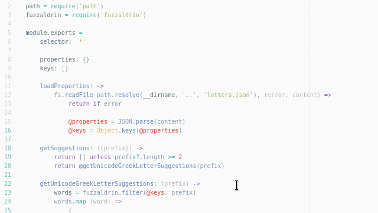

# autocomplete+ greek letters suggestions 

#### NOTE: Some features have been left some time to be implemented, to allow `Hacktoberfest` participants to get some easy pull requests. 

## Features

* Makes greek letter autocompletes possible for any syntax. For instance, now that the internet is buzzing with people using emojis as JS variables, why wouldn't it be able to name `var delta = a - b` as `var Δ = a - b`?
* More features to come.

## Acknowledgements

* [autocomplete-plus](https://atom.io/packages/autocomplete-plus) and
  [its document of the provider API](https://github.com/atom/autocomplete-plus/wiki/Provider-API)
  inspired and helped me a lot to create this package
* [gemoji](https://github.com/github/gemoji) gives [a JSON file](https://raw.githubusercontent.com/github/gemoji/master/db/emoji.json) for unicode emojis
* [original projet](https://github.com/atom/autocomplete-emojis) for the base code to start this off of
